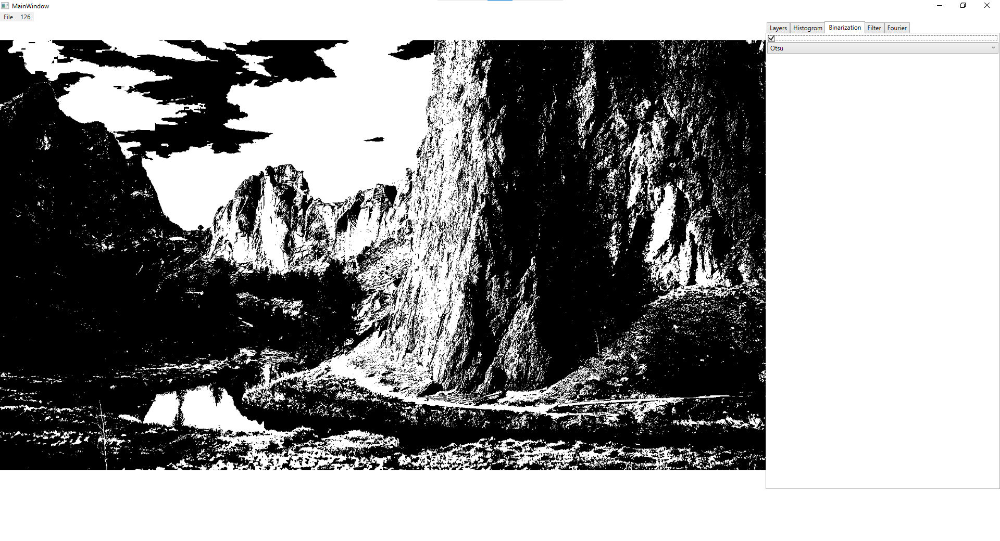
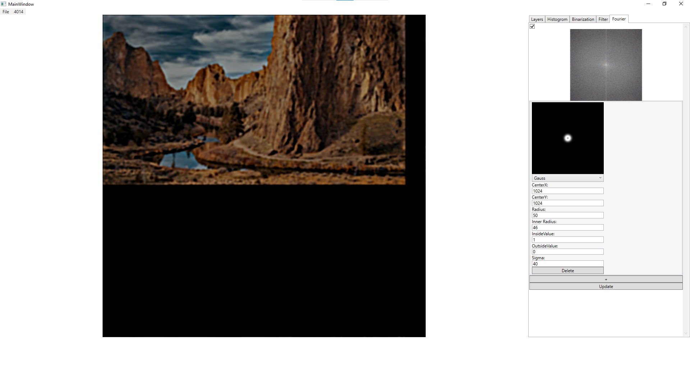

# SCOI — Система обработки изображений (учебный проект)

**SCOI** (Smart Computer Vision Interface) — десктопное приложение на .NET WPF для обработки и анализа изображений. Разработано в рамках лабораторных работ по дисциплинам, связанным с цифровой обработкой сигналов и компьютерным зрением.

 *(замените на реальный скриншот)*

---

## О проекте

Этот проект объединяет несколько лабораторных работ в единое приложение с графическим интерфейсом. В отличие от типовых учебных заданий, где каждая операция делается отдельно, здесь реализована **программа**, позволяющая выполнять этапы обработки изображения в одном окне и видеть результат в реальном времени.

**Основная цель проекта** — на практике закрепить теоретические знания по цифровой обработке изображений и освоить разработку десктопных приложений на WPF.

---

## Реализованный функционал

Приложение включает все ключевые методы обработки изображений, изученные в рамках курса:

### 📂 Работа с изображениями
- Загрузка и сохранение изображений
- Отображение в интерфейсе с возможностью масштабирования
- Управление слоями

### 📊 Гистограмма
- Построение гистограммы яркости пикселей
- Визуализация распределения интенсивностей

### ⚫ Бинаризация (пороговая обработка)
Реализовано **6 алгоритмов**:
- **Otsu** — глобальный оптимальный порог
- **Niblack** — адаптивный локальный порог
- **Sauvola** — улучшенный адаптивный порог
- **Gavr** — глобальный средний порог
- **Christian**, **Bradley** — дополнительные методы

### 🎛️ Фильтрация
- **Линейная фильтрация** — свёртка с пользовательским ядром
- **Медианная фильтрация** — эффективное подавление импульсного шума
- Фильтр Гаусса с настраиваемой сигмой

### 🌀 Преобразование Фурье
- Прямое и обратное дискретное преобразование Фурье
- Отображение амплитудного спектра
- Частотная фильтрация:
  - Круговая маска (подавление/выделение определённых частот)
  - Кольцевая маска (полосовой фильтр)
  - Настройка радиусов и значений внутри/снаружи маски

### 🖼️ Дополнительные инструменты
- Изменение размера изображения (Resize)
- Регулировка альфа-канала (прозрачности)
- Настройка яркости и контраста (Offset, Multiplier)
- Обрезка изображения (Cut)

---

## Технологии

| Компонент | Технология |
|-----------|------------|
| Платформа | .NET (WPF) |
| Язык программирования | C# |
| Интерфейс | XAML |
| Графика | System.Drawing, WriteableBitmap |
| Алгоритмы | Реализованы вручную на C# (без OpenCV и готовых библиотек CV) |
| Система контроля версий | Git |

---

## Скриншоты

| Главное окно | Бинаризация (Otsu) | Преобразование Фурье |
|--------------|--------------------|-----------------------|
|  | |  |
*Замените на свои реальные скриншоты*

---

## Установка и запуск

### Требования
- Windows 7/10/11
- .NET Framework 4.7.2 или выше
- Visual Studio 2019/2022 (рекомендуется)

### Инструкция
1. Клонируйте репозиторий:
```bash
git clone https://github.com/Popodada3221/SCOI.git
```
2. Откройте файл решения SCOI.sln в Visual Studio.

3. Соберите проект (Build → Build Solution).

4. Запустите приложение (F5).